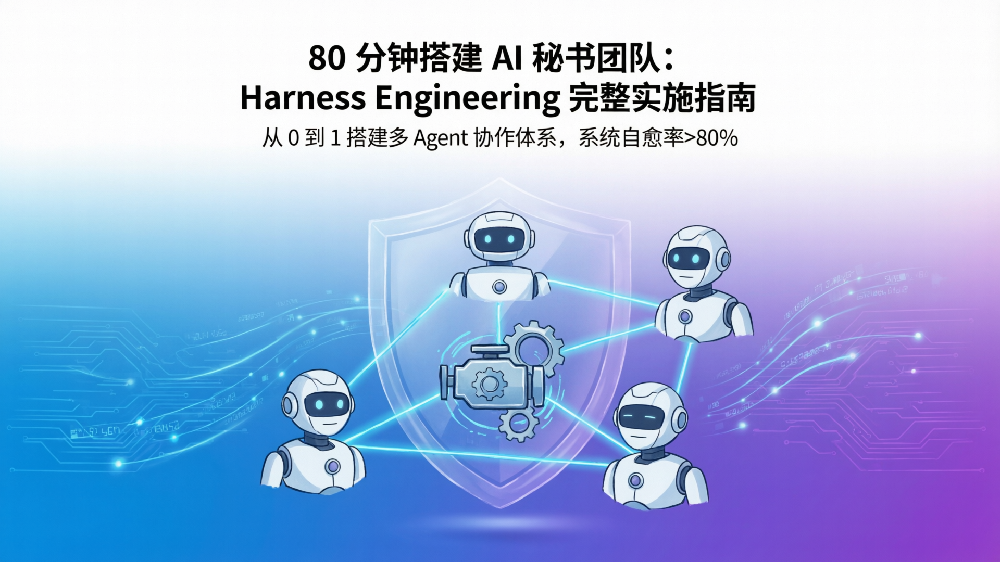

# 80 分钟搭建 AI 秘书团队：Harness Engineering 完整实施指南



> **摘要**：从 0 到 1 搭建基于 Harness Engineering 的多 Agent 协作系统，4 个阶段、15 个脚本、5 个工作流模板，系统自愈率>80%。本文完整公开所有代码和配置，可直接复用。

---

## 📋 快速开始

**核心成果**：
- ✅ 4 个阶段、15 个脚本、5 个工作流模板
- ✅ 系统自愈率>80%，故障自动恢复
- ✅ 智能路由、并行编排、可观测性拉满
- ✅ 所有代码开源，可直接部署

**完整文档**：[阅读全文 →](./harness-engineering-implementation-guide.md)

---

## 📱 关注我

**微信公众号**: 智能体开发

专注于分享：
- AI Agent 开发与自动化
- Harness Engineering 实战
- OpenClaw 技术应用
- 编程效率提升


*扫码关注，获取最新文章和技术干货*

---

## 📚 文档导航

| 文档 | 说明 |
|------|------|
| [完整实施指南](./harness-engineering-implementation-guide.md) | 4 个阶段完整实施过程 |
| [一键发布流程](./one-click-publish-workflow.md) | 知乎/掘金/GitHub 一键发布 |
| [公众号发布流程](./wechat-publish-manual.md) | 微信公众号半自动发布 |

---

## 🚀 快速部署

```bash
# 克隆代码
git clone https://github.com/subaochen/harness-engineering-guide.git
cd harness-engineering-guide

# 查看文档
cat README.md

# 阅读完整指南
cat harness-engineering-implementation-guide.md
```

---

## 📊 资源统计

| 类别 | 数量 |
|------|------|
| 脚本 | 15 个 |
| 配置文件 | 3 个 |
| 工作流模板 | 5 个 |
| QA 检查清单 | 3 个 |
| 数据库表 | 3 张 |

---

## 🎯 核心能力

| 能力 | 实现方式 | 效果 |
|------|----------|------|
| 可追溯 | 事务日志 + 唯一 ID | 100% 事务可查询 |
| 可观测 | 心跳监控 + 多维表格 | 5 分钟发现异常 |
| 可恢复 | 自动重试 + 降级切换 | 自愈率>80% |
| 可编排 | 工作流引擎 + 并行分发 | 复杂任务自动化 |

---

## 💡 关键决策

1. **先固化流程，再自动化**（阶段 1 最重要）
2. **可观测性是基础**（没有监控就没有优化）
3. **故障恢复要分层**（自动→降级→人工）
4. **工作流编排是终极目标**（解放人力）

---

## 📞 联系我们

- **微信公众号**: 智能体开发
- **GitHub**: [@subaochen](https://github.com/subaochen)
- **问题反馈**: [Issues](https://github.com/subaochen/harness-engineering-guide/issues)

---

**作者**: 秘书长 AI 团队  
**发布日期**: 2026-04-21  
**许可证**: CC BY-NC-SA 4.0

---

*如果这个项目对你有帮助，欢迎 Star ⭐️ 支持！*
